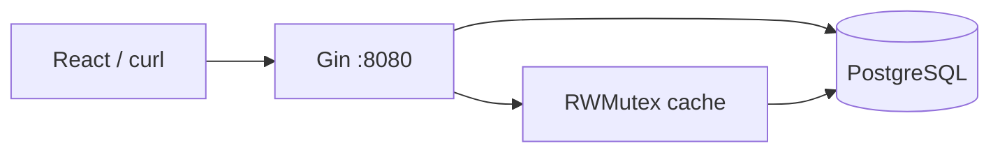

# FlagFlow

**Feature Flag Service** auto-hospedado: 100% local, gratis, sin nube ni tarjeta de crédito. Cloná el repo, ejecutá Docker y tenés la API en `http://localhost:8080`.

[](https://github.com/ovejero92/flagflow)

## Requisitos

- [Docker](https://www.docker.com/get-started/)
- [Docker Compose](https://docs.docker.com/compose/)

No necesitás instalar Go para usar el servicio (solo Docker).

## Inicio rápido

```bash
git clone https://github.com/ovejero92/flagflow.git
cd flagflow
docker-compose up -d
```

En unos segundos:

- **API:** http://localhost:8080  
- **Health:** http://localhost:8080/api/v1/health  

### Atajos de inicio

| Sistema | Comando |
|---------|---------|
| Windows | `start.bat` |
| Mac / Linux | `chmod +x start.sh && ./start.sh` |

### Detener

```bash
docker-compose down
```

Para eliminar también los datos de Postgres:

```bash
docker-compose down -v
```

## ¿Qué incluye Docker Compose?

| Servicio | Descripción |
|----------|-------------|
| `postgres` | Base de datos PostgreSQL 15 |
| `feature-flag-service` | API en Go (puerto 8080) |

El backend se conecta a Postgres por la red interna de Docker (`postgres` como hostname). Al iniciar el contenedor Go, `entrypoint.sh` ejecuta las migraciones y luego arranca el servidor.

## Probar con curl

```bash
# 1. Health check
curl http://localhost:8080/api/v1/health

# 2. Crear aplicación (copiá el "id" de la respuesta)
curl -X POST http://localhost:8080/api/v1/apps \
  -H "Content-Type: application/json" \
  -d '{"name":"mi-app","description":"App de demo"}'

# 3. Crear feature flag (reemplazá APP_ID)
curl -X POST http://localhost:8080/api/v1/apps/APP_ID/flags \
  -H "Content-Type: application/json" \
  -d '{
    "name": "dark-mode",
    "description": "Tema oscuro",
    "enabled": true,
    "rollout_percentage": 50
  }'

# 4. Consultar flag (endpoint público, usa cache)
curl http://localhost:8080/api/v1/public/flag/APP_ID/dark-mode \
  -H "X-User-Id: user-123"
```

Respuesta esperada: `{"enabled":true}` o `{"enabled":false}` según rollout y usuario.

## SDK JavaScript / TypeScript (React)

Archivo: [`pkg/sdk/js/feature-flags-sdk.ts`](pkg/sdk/js/feature-flags-sdk.ts)

Por defecto apunta a **`http://localhost:8080`**:

```typescript
import { FeatureFlagClient } from "./feature-flags-sdk";

// Solo necesitás el UUID de tu app
const client = new FeatureFlagClient("TU-APP-UUID");

// Evalúa un flag (cache local 5 segundos)
const enabled = await client.isEnabled("dark-mode", "user-123");

// Todos los flags de la app
const all = await client.getAllFlags("user-123");
```

Otro host (opcional):

```typescript
const client = new FeatureFlagClient("TU-APP-UUID", "http://localhost:8080");
```

Ejemplo React: [`pkg/sdk/js/FeatureFlagExample.tsx`](pkg/sdk/js/FeatureFlagExample.tsx)

## Landing page (GitHub Pages / Netlify)

La carpeta [`landing/`](landing/) es un sitio estático autocontenido para presentar el proyecto. Podés desplegar solo esa carpeta:

- **GitHub Pages:** configurá la fuente en `/landing` o subí el contenido a `gh-pages`.
- **Netlify:** directorio de publicación `landing`.

## Desarrollo local (opcional, con Go instalado)

```bash
docker-compose up -d postgres
cp .env.example .env
go run ./cmd/server
```

En Windows sin `make`: `.\scripts.ps1 run`

## Arquitectura



- **Concurrencia:** `sync.RWMutex`, goroutine de refresh de cache, graceful shutdown.
- **Rollout:** hash consistente `flagName + X-User-Id` para porcentajes &lt; 100%.

## API (resumen)

| Método | Ruta |
|--------|------|
| GET | `/api/v1/health` |
| POST/GET/PUT/DELETE | `/api/v1/apps` … |
| POST/GET | `/api/v1/apps/:appId/flags` |
| GET/PUT/DELETE | `/api/v1/flags/:flagId` |
| GET | `/api/v1/public/flag/:appId/:flagName` |

## Estructura del proyecto

```
flagflow/
├── cmd/server/          # Entrada del servidor
├── internal/            # API, cache, db, models
├── pkg/sdk/             # SDK JS y Go
├── migrations/          # SQL
├── landing/             # Sitio estático (Pages / Netlify)
├── docker-compose.yml
├── entrypoint.sh        # Migraciones + arranque en Docker
├── start.sh / start.bat # Inicio rápido
└── Dockerfile
```

## Licencia

MIT — ver [LICENSE](LICENSE).
